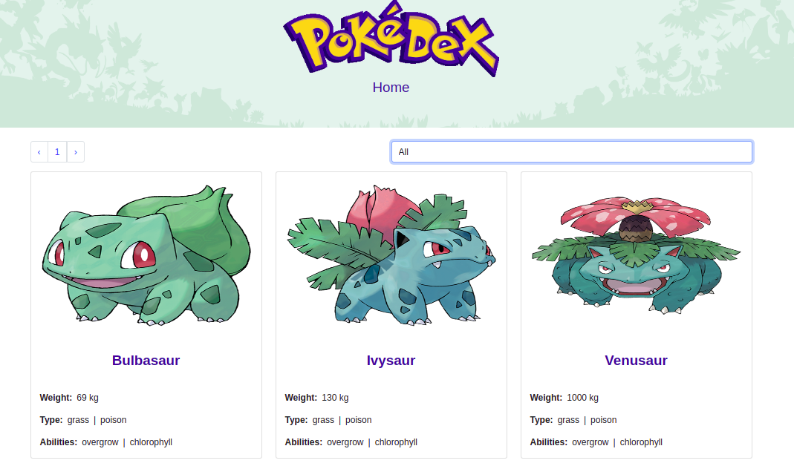

<h1 align="center">Pokedex</h1>

<p align="center">
  <strong>Made by Alan Soto</strong>
  <br>
  This single page app is about a basic Pokedex where you can find up to 60 Pokémon (6 x page). On the home page, you will get an ordered list of the first 6 Pokémon cards, each with a picture and a short description such as name, weight, type, and abilities. You can filter the list by type of Pokémon such as grass, poison, fire, water, etc., to find your favorite Pokémon more easily. Can't find your favorite? don't worry, just click the ">" symbol to see the next group of Pokémon.
  If you click on the name, the application will take you to the details page where you will find more detailed information.<br>
   The data is fetched from my own API  <a href="https://github.com/AlanSoto31/pokedex-api" target="_blank">pokedex-api</a>, which at the same time requests data from the official <a href="https://pokeapi.co/" target="_blank">Poke Api</a>.
</p>



<hr>

<p align="center">
  <a href="https://github.com/AlanSoto31/pokedex-react/issues">
    
  </a>
   ‎ ‎ ‎ ‎
  <a href="https://github.com/AlanSoto31/pokedex-react/issues">
    
  </a>
</p>

<hr>


## Table of Contents

- [Live Demo](#Live-Demo)
- [Built With](#built-With)
- [🖥️ Getting Started](#getting-Started)
  - [Prerequisites](#prerequisites)
  - [Setup](#setup)
  - [Testing](#testing)
- [👥 Author](#author)
- [🤝 Contributing](#contributing)
- [⭐ Show your support](#show-your-support)


## Live Demo

[Live version](https://pokedex-react-31.herokuapp.com/)


## Built With

- JavaScript
- React
- Redux
- Bootstrap
- Jest
- VS Code
- Heroku


## Getting Started

Get a local copy, type on console...

````
 $ cd <'the location yo want to save the project'>
 $ git clone https://github.com/AlanSoto31/pokedex-react.git
 ````


### Prerequisites

- nodejs 14.16.0


### Setup

1. Go inside the project folder: `cd pokedex-react`.
2. Install dependencies: `npm install`.
4. Start the application: `npm run start`
5. Wait for the server to launch the app.
6. Stop the application: `ctrl + c`


### Testing

1. Go inside the project folder: `cd pokedex-react`.
2. Run the test: `npm run test`.


## Author

👤 **Alan Soto**

- GitHub: [@AlanSoto31](https://github.com/AlanSoto31)
- Twitter: [@Alan_Soto31](https://twitter.com/Alan_Soto31)
- LinkedIn: [Alan Soto](https://www.linkedin.com/in/alan-soto-valle/)


## Contributing

Contributions, issues and feature requests are welcome!

Feel free to check the [issues page](https://github.com/AlanSoto31/pokedex-react/issues).


## Show your support

Give a ⭐️ if you like this project!


## 📝 License

This project is [MIT](https://opensource.org/licenses/MIT) licensed.
